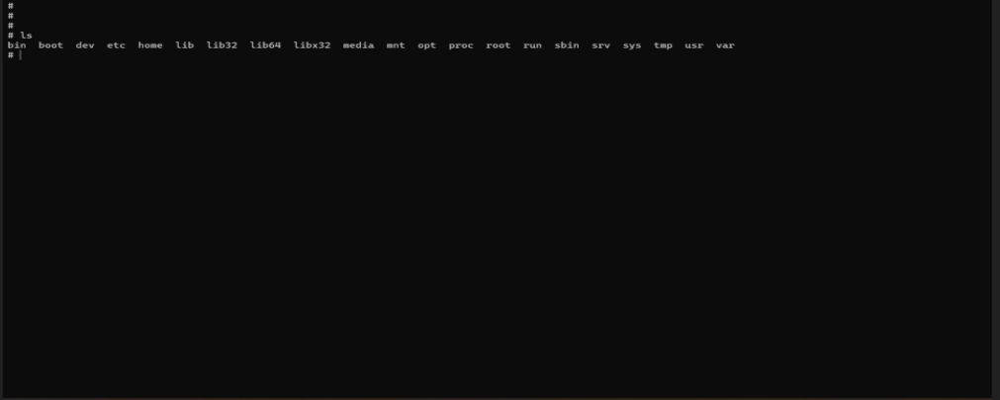
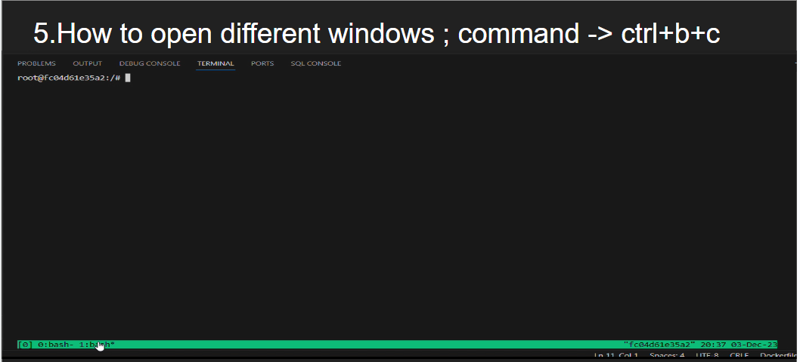
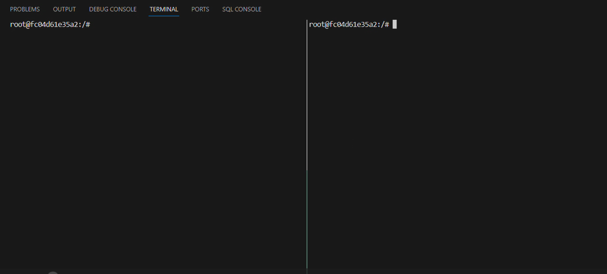

# The Full Process Of Using Screen

## Within the screen session:

* Use your preferred Linux commands to work with images:
* Viewing images: Use display, feh, sxiv, or other image viewers based on your preference.
* Editing images: Use image editors like GIMP, Krita, or Inkscape depending on your needs.
* Other image-related tasks: Run scripts, tools, or applications as required.

## Using multiple virtual terminals:
* Press Ctrl+a followed by "c" to create a new virtual terminal within the screen session.
* Switch between terminals using Ctrl+a followed by a number (1-9).
* This allows you to work with different images or tasks simultaneously.

## Additional screen commands:

* screen -ls: List available screen sessions.
* screen -ls [ID]: See information about a specific session.
* screen -R: Reattach to the most recently used session.
* screen -help: View more details and options for the screen command.

